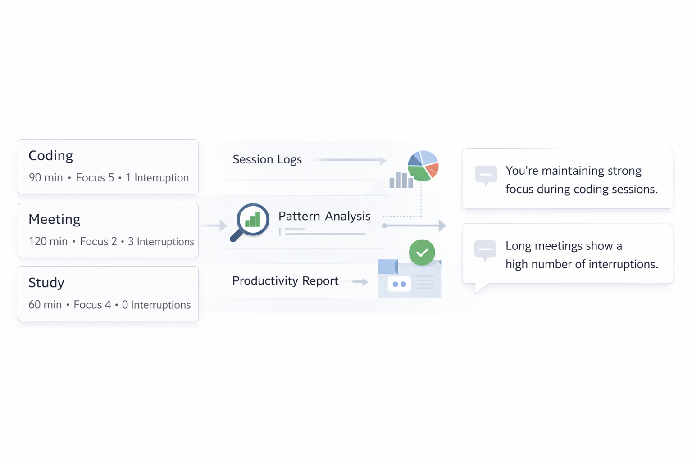

# API de Foco e Produtividade

API backend desenvolvida como um "Log de Performance" para registrar sessões de trabalho e gerar diagnósticos inteligentes sobre foco, produtividade e padrões de concentração.

A proposta do projeto é ir além de um simples registro de tarefas, oferecendo uma análise contextual do estado de foco e produtividade do usuário ao longo das sessões de trabalho ou estudo.

## Fluxo geral da aplicação:



## Objetivo

Permitir o registro de sessões de foco e transformar esses dados em insights simples e úteis sobre produtividade, padrões de concentração e interrupções. Destacando:
- média de foco
- tempo total focado
- feedback automático baseado no comportamento registrado
- padrões identificados nas sessões

## Tecnologias

- Python 3.14
- FastAPI
- SQLAlchemy
- SQLite
- Pydantic
- Uvicorn

## Funcionalidades

- Registro de sessões de foco com validação automática
- Persistência local com SQLite
- Listagem de registros salvos
- Diagnóstico inteligente com base nos dados cadastrados
- Análise simples de padrões por categoria, interrupções e duração da sessão
- Documentação interativa automática com Swagger/OpenAPI

## Estrutura do projeto

```txt
.
├── README.md
├── app
│   ├── api
│   │   └── routes.py
│   ├── core
│   │   └── database.py
│   ├── main.py
│   ├── models
│   │   └── focus_log.py
│   ├── schemas
│   │   └── focus_log.py
│   └── services
│       └── diagnostic_service.py
└── focus.db
```

## Como rodar o projeto

Pré-requisitos:
- Python 3.14+
- Make

1. Criar e ativar o ambiente virtual
```bash
python3.14 -m venv .venv
source .venv/bin/activate
```

2. Instalar dependências
```bash
make install
```

3. Rodar a aplicação
```bash
make run
```

4. Abrir a documentação interativa
Acesse: http://localhost:8000/docs

## Endpoints
### `GET /`

Endpoint de verificação da API.

Resposta:
```json
{
  "status": "ok"
}
```

### `POST /registro-foco`
Registra uma sessão de foco.

Campos enviados:
- nivel_foco: inteiro entre 1 e 5
- tempo_minutos: inteiro maior que 0
- comentario: texto descritivo
- categoria: texto representando o tipo da atividade
- interrupcoes: inteiro maior ou igual a 0

Exemplo de payload:
```json
{
  "nivel_foco": 5,
  "tempo_minutos": 120,
  "comentario": "Implementando persistência SQLite",
  "categoria": "coding",
  "interrupcoes": 1
}
```

### `GET /registros-foco`
Retorna todos os registros salvos no banco.

### `GET /diagnostico-produtividade`
Retorna o resumo analítico da produtividade com:

- média do nível de foco
- tempo total focado
- feedback automático
- padrões detectados

Exemplo de resposta:
```json
{
  "media_foco": 4.2,
  "tempo_total_focado": 480,
  "feedback": "Você está em um excelente ritmo de produtividade e concentração.",
  "padroes_detectados": [
    "Você mantém um padrão consistente de alta concentração.",
    "A categoria 'coding' apresenta seu melhor desempenho."
  ]
}
```


## Decisões de projeto

### FastAPI
Escolhido pela simplicidade, validação automática, tipagem clara e documentação Swagger gerada automaticamente.

### SQLite
Escolhido por ser suficiente para o escopo do teste, além de exigir pouca configuração e facilitar a execução local.

### Separação por camadas
O projeto foi organizado em:

- api: rotas
- schemas: validação e serialização
- models: mapeamento ORM
- services: regras de negócio e diagnóstico
- core: configuração de banco

Essa separação melhora a legibilidade e facilita a evolução do projeto.

### Inteligência do diagnóstico

O diagnóstico não se limita à média e à soma de minutos. A API também analisa heurísticas simples, como:

- sessões com muitas interrupções
- sessões muito longas
- categoria com melhor desempenho médio
- padrão geral de foco

Isso permite transformar registros simples em insights úteis sobre padrões de produtividade e concentração.

### Uso de IA

Ferramentas de IA foram utilizadas como apoio para:

- brainstorming da arquitetura e ideia
- refinamento da estrutura inicial do projeto e início rápido
- geração de imagem utilizada neste readme

As decisões finais de arquitetura, implementação e organização foram revisadas e refinadas manualmente para manter clareza, simplicidade e coerência técnica.

#### Prompts utilizados durante o desenvolvimento:

```md
# Arquitetura inicial e Decisões Arquiteturais
- FastAPI foi escolhido pela simplicidade e tipagem forte.
- SQLite foi utilizado por exigir pouca configuração.
- A separação em api, services, models e schemas foi adotada para melhorar organização e manutenção.
- O projeto priorizou simplicidade e clareza ao invés de abstrações excessivas.

- Discussão sobre estruturação com FastAPI utilizando:
  - rotas
  - schemas
  - services
  - models
  - SQLite (SQLAlchemy)

Objetivo:
manter simplicidade, clareza e separação de responsabilidades.

# Heurísticas do diagnóstico
Exploração de ideias para transformar registros simples em feedbacks úteis de produtividade.

Exemplos discutidos:
- impacto de interrupções
- sessões excessivamente longas
- categorias com melhor desempenho médio
- padrões gerais de concentração

# Refinamento de experiência de uso
Sugestões relacionadas a:
- organização do README
- Makefile
- experiência de execução local
- clareza da documentação
```

## Melhorias futuras
- adicionar timestamps por registro
- incluir testes automatizados
- criar filtros por categoria e período
- melhorar o score de produtividade
- adicionar exportação de relatórios
- adicionar autenticação caso o projeto evolua para múltiplos usuários

## Filosofia do projeto

O projeto foi desenvolvido com foco em simplicidade, clareza e utilidade prática.

A proposta não foi construir uma arquitetura excessivamente complexa, mas sim entregar uma API funcional, organizada e fácil de compreender, priorizando legibilidade, experiência de uso e capacidade de evolução.

## Autor
Projeto desenvolvido como teste técnico de backend em Python.